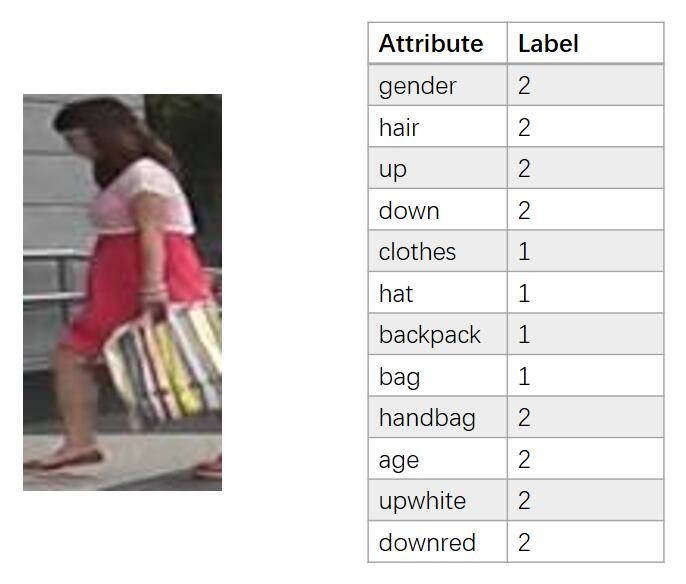

# Market-1501_Attribute

The evaluation code will be added soon.

## About dataset
We annotate 27attributes for [Market-1501](http://www.liangzheng.org/Project/project_reid.html). 
The original dataset contains 751 identities for training and 750 identities for testing. 
The attributes are annotated in the identity level, 
thus the file contains 27 x 751 attributes for training and 27 x 750 attributesfor test.

The 27 attributes are: 

| attribute | representation in file | label |
| :----: | :----: | :----: |
| gender | gender | male(1), female(2) |
| hair length | hair| short hair(1), long hair(2)    |
| sleeve length | up | long sleeve(1), short sleeve(2) |
| length of lower-body clothing | down | long lower body clothing(1), short(2)    |
| type of lower-body clothing| clothes| dress(1), pants(2)    |
| wearing hat| hat | no(1), yes(2) |
| carrying backpack| backpack | no(1), yes(2) |
| carrying bag| bag | no(1), yes(2) |
| carrying handbag| handbag | no(1), yes(2) |
| age| age | young(1), teenager(2), adult(3), old(4) |
| 8 color of upper-body clothing| upblack, upwhite, upred, uppurple, upyellow, upgray, upblue, upgreen | no(1), yes(2) |
| 9 color of lower-body clothing| downblack, downwhite, downpink, downpurple, downyellow, downgray, downblue, downgreen,downbrown | no(1), yes(2) |

Note that the though there are 8 and 9 attributes for upper-body clothing and lower-body clothing, only one color is labeled as yes (2) for an identity.

## Sample



## Evaluation

To evaluate, you need to predict the attributes for test data(i.e., 13115 x 12 matrix) and save them in advance. "gallery_market.mat" is one prediction example. Then download the code "evaluate_market_attribute.m" in this repository, change the image path and run it to evaluate.


## cite

If you use this dataset in your research, please kindly cite our work as,
```
@article{lin2017improving,
  title={Improving Person Re-identification by Attribute and Identity Learning},
  author={Lin, Yutian and Zheng, Liang and Zheng, Zhedong and, Wu Yu and, Yang, Yi},
  journal={arXiv preprint arXiv:1703.07220},
  year={2017}
}
```

## Acknowledgement

We thank Dr. Gao for annotating part of the dataset.
